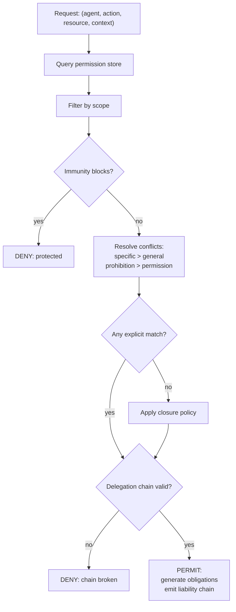

# Description

## Source material

This project implements the formal model described in
[`references/Deontic Logic for Agent Permissions - A Formal Framework for AI Agent Governance.pdf`](references/Deontic%20Logic%20for%20Agent%20Permissions%20-%20A%20Formal%20Framework%20for%20AI%20Agent%20Governance.pdf),
an article proposing a Hohfeldian + deontic-logic foundation for AI agent authorization (written as a
critique of ad-hoc, path-based MCP authorization). A related project, cited by the user as precedent for
tooling choice, is tracked in [`references/External-Links.md`](references/External-Links.md).

## What is being built (this iteration)

**The semantic reasoner only** — the core logical engine that decides permission questions. Explicitly
**not** in scope for this iteration: the MCP server, the textual permission DSL/parser, the governance
dashboard, and automated recourse/escalation policy (these are later phases of the source article, and
will be picked up as future iterations once the reasoner itself exists and is trustworthy).

Target: Python 3.14, standard library only if at all possible. SymPy (`sympy.logic`) is pre-approved as
a fallback dependency — but only if a real need for general propositional satisfiability/boolean
simplification emerges that the stdlib can't reasonably cover; it is not assumed necessary up front (see
*Open design question* below).

## Theoretical foundation

### Hohfeldian legal relations

Wesley Hohfeld's decomposition of "rights" into eight fundamental legal relations, in four correlative
pairs, each with a jural opposite:

| Holder | Correlative | Opposite (of holder) |
|---|---|---|
| Right (claim-right) | Duty | No-Right |
| Privilege (liberty) | No-Right | Duty |
| Power | Liability | Disability |
| Immunity | Disability | Power |

- **Right–Duty**: if A has a right that B perform X, B has a correlative duty to perform X.
- **Privilege–NoRight**: if A has a privilege to do X, no one has a right that A not do X — permission
  without obligation; A *may* act but need not.
- **Power–Liability**: if A has power to change B's normative position (grant/revoke/modify), B is liable
  to that change. This is the delegation/authorization/governance relation.
- **Immunity–Disability**: the inverse of power — if A has immunity from B's attempted changes, B is
  disabled from affecting A's position.

### Deontic modal operators

Standard deontic logic, three operators over a proposition `p`:

- `O(p)` — it is obligatory that p
- `P(p)` — it is permitted that p
- `F(p)` — it is forbidden that p

Inter-definitions the reasoner must respect as identities, not independent facts:

- `P(p) ≡ ¬O(¬p)` (permitted iff not obligated-not-to)
- `F(p) ≡ O(¬p) ≡ ¬P(p)` (forbidden iff not permitted)

### The permission calculus

Core domain types:

- `Agent`, `Resource` — identifiers
- `Action` — one of `read | write | execute | delegate | revoke`
- `Scope` — `temporal_bound × resource_bound × context_bound`
- `Permission` — a structured tuple `(agent, action, resource, scope, provenance)`, not a bare boolean.
  Every permission carries:
  1. **Provenance** — who granted it, under what authority.
  2. **Scope** — temporal bounds (`valid_from`/`valid_until`), execution contexts, and conditions.
  3. **Delegation info** — whether it's delegable, and under what constraints (e.g. max delegation
     depth, approval thresholds).

Each permission is tagged with its Hohfeldian **relation type** (`privilege | right | power | immunity`),
which determines what correlative obligation/liability/disability it generates on other agents.

### Obligation chains from delegation

When agent A delegates a permission to agent B, the reasoner must derive the correlative obligations
automatically, not require them to be stated separately:

```
delegate(A, B, permission(read, R, S)) →
    O(A, audit(B.actions(R))) ∧
    O(A, revoke(B, R) | violation(B, R)) ∧
    liable(A, damages(B.actions(R)))
```

I.e. delegating read access on resource R to B within scope S obliges A to audit B's actions, obliges A
to revoke on violation, and makes A liable for damages from B's actions under that grant.

### The closure problem

What is the normative status of an action nobody explicitly addressed? Two closure policies, selectable
per deployment/agent (not a global constant):

- **Permissive closure**: everything not forbidden is permitted (suits a general-purpose assistant with
  explicit prohibitions).
- **Prohibitive closure**: everything not permitted is forbidden (suits a high-stakes agent, e.g.
  financial trading, with explicit permissions).

### Permission resolution algorithm

Given a request `(agent, action, resource, context)`, the reasoner must:

1. Query the permission store for candidates matching agent/action/resource.
2. Filter candidates by scope (temporal bounds, context, conditions).
3. Check whether an immunity blocks the operation outright → if so, deny/protect immediately.
4. Resolve conflicts among remaining candidates using precedence rules: **specific beats general**,
   **prohibition beats permission** (both to be applied in that order, or as configured).
5. Validate the request against closure policy if nothing explicit matched.
6. Validate the full delegation chain (each link's grantor actually held the power to grant, within its
   own constraints and depth limits) — a broken chain denies the request regardless of the leaf
   permission.
7. Emit a decision (`PERMIT` or `DENY`), and on `PERMIT`, the obligations generated by that grant (e.g.
   audit requirements) and the liability chain (which agents are answerable, in what order, if this
   action later causes harm).



### Liability chains

Each grant along a delegation path is recorded, e.g. `liability_chain: [C, B, A]` for a permission that
flowed A → B → C. If C causes harm while acting under it: C is directly responsible, B is responsible
for inadequate oversight (if it violated its audit obligation), A is responsible for the delegation
policy that allowed it. The reasoner's job is to expose this chain on demand, not to adjudicate fault.

## What the reasoner must be able to do

Concretely, as a Python library (no server, no CLI, no persistence layer implied yet):

- Represent agents, resources, actions, scopes, and permissions as the structured types above.
- Represent and evaluate Hohfeldian relations and their correlatives/opposites.
- Represent and evaluate deontic operators (`O`, `P`, `F`) with their inter-definitions enforced as
  invariants, not restated per-fact.
- Resolve a permission query end-to-end per the algorithm above, including scope filtering, immunity
  short-circuiting, conflict precedence, closure-policy fallback, and delegation-chain validation.
- Derive correlative obligations and liability chains from delegation grants automatically.
- Support both closure policies, selectable per policy set (not hardcoded to one).

## Open design question (carried to Requirements)

Whether the reasoner needs genuine propositional satisfiability/boolean simplification (the kind
`sympy.logic` provides in the precedent project) depends on how expressive `condition` clauses in scopes
are allowed to be. If they stay simple predicate checks against a request context, pure stdlib is
sufficient. If they must support arbitrary boolean composition of conditions that needs
simplification/consistency-checking, SymPy becomes the pragmatic choice over hand-rolling a SAT solver.
This will be pinned down precisely during `/requirements`.
