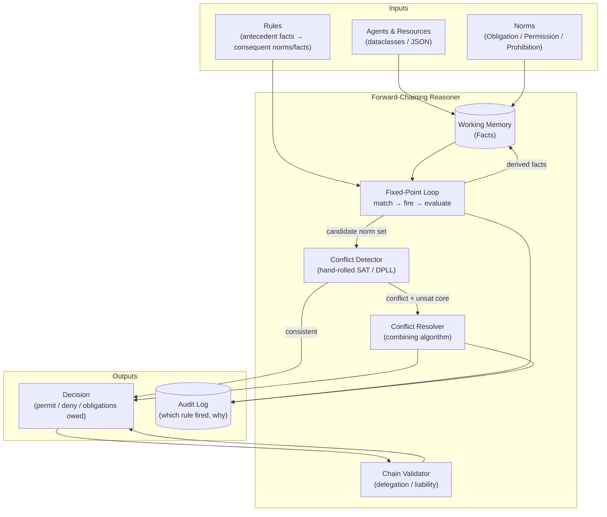
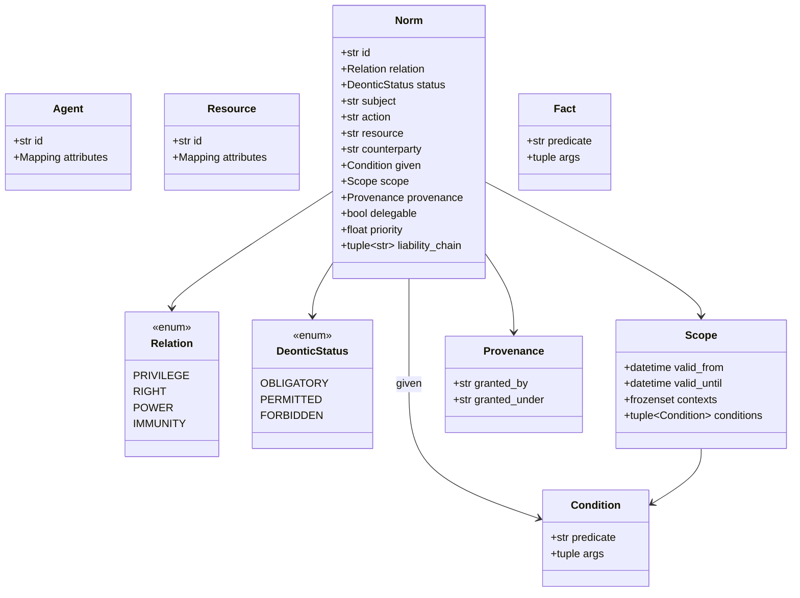
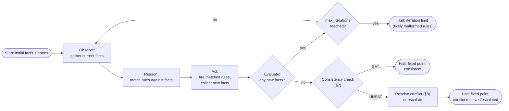
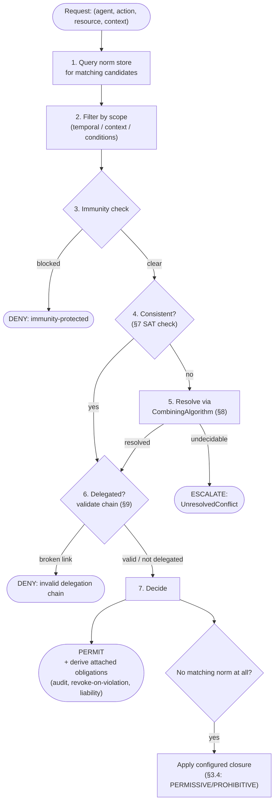

# Deontic Reasoner for Agentic Systems — Formulation & Implementation Guide

## 0. How to read this document

This is a design spec, not a tutorial: §1–2 frame the problem and constraints, §3–8 are the formulation (what the system computes and why), §9–11 are the implementation (how it's built, module by module), §12–13 are requirements and risks, §14 is a worked test suite, §15 is what's deliberately left open. Every non-obvious design choice cites the wiki page it's grounded in — where the wiki flags something as an open question, this document states a recommendation and says so explicitly rather than silently picking one.

## 1. Purpose

Build a Python library that takes a set of **norms** (obligations, permissions, prohibitions, and the Hohfeldian relations that generalize them — rights, privileges, powers, immunities) plus a set of **facts** about agents and their actions, and derives — by forward chaining to a fixed point — the full set of what's currently obligatory, permitted, and forbidden, flagging any genuine conflicts along the way with an explanation of *which* norms conflict, not just that they do. It targets the same problem as [[Deontic Logic for Agent Permissions - A Formal Framework for AI Agent Governance]] (AI agent tool/resource permissions, delegation, liability) but as an actual reasoning *engine* rather than an informal schema — a from-scratch implementation, not a wrapper around Prolog, Answer Set Programming, or any other external logic engine. [[AI Agent Permission Calculus]]

## 2. Constraints (given, non-negotiable)

- **Python 3.14.**
- **Standard library only, wherever feasible.** If something genuinely cannot be done reasonably in stdlib, the only acceptable dependency is **SymPy** — no Prolog/ASP bindings, no external processes, no other third-party logic/rule-engine library.
- **Data representation**: dataclasses (or JSON-serializable equivalents) for norms, facts, agents, and domain entities — no ORM, no database dependency for the core reasoning layer.
- **Inference strategy**: forward chaining (facts + rules → derived facts, iterated to a fixed point) — not backward chaining/query-driven resolution (which is what Prolog-style engines do).

This document resolves several questions the wiki left explicitly open, in the direction these constraints force:

| Wiki's open question | This document's answer, and why |
|---|---|
| Depend on Experta, or hand-roll the rule engine? [[Experta - Forward-Chaining Rule Engine]] | **Hand-roll.** Experta is stdlib-adjacent but is a third-party dependency; the constraint says stdlib-first. Experta's own README doesn't even specify its matching algorithm or conflict-resolution behavior, so depending on it wouldn't save the design work anyway — only the typing/decorator boilerplate. |
| Depend on pyDatalog, or hand-roll chain validation? [[pyDatalog - Declarative Datalog Engine for Python]] | **Hand-roll**, using `graphlib.TopologicalSorter` (stdlib, Python 3.9+) for cycle detection plus a small recursive-closure routine — pyDatalog's recursive-rule *pattern* (§10) is adopted, the library itself is not. |
| Hand-roll DPLL, or depend on SymPy's SAT solver? [[SAT Solving and DPLL]] | **Hand-roll**, per the wiki's own conclusion after reading SymPy's actual `dpll2.py` source: the useful core is ~240 lines of pure-stdlib Python. This document specifies a slightly larger scope than that page's original conclusion (assumption literals + unsat-core extraction, per its pysat-comparison revision), still entirely stdlib. |
| SymPy as fallback | Reserved, per the constraint, for exactly one place this document flags as a legitimate escape hatch: complex condition-expression evaluation (§6.4) if the hand-rolled mini-language in this document turns out to be insufficient. Not used anywhere in the baseline design. |

## 3. Formal Semantics

### 3.1 Core operators

Following Standard Deontic Logic (SDL), obligation `O` is primitive; permission and prohibition are defined from it:

- `O(φ)` — φ is obligatory
- `P(φ) =def ¬O(¬φ)` — φ is permitted
- `F(φ) =def O(¬φ) ≡ ¬P(φ)` — φ is forbidden

**Deliberate departure from SDL**: this reasoner does **not** globally enforce SDL's NC axiom (`Oφ → ¬O¬φ`, "obligations cannot conflict"). Real derived obligation sets *can* conflict (two delegators independently imposing incompatible duties), and a logic that rules this out by fiat can't represent the situation at all — it can only crash. Instead, conflicts are **detected** (§7) and **resolved** by an explicit, configurable policy (§8), exactly the "prima facie vs. all-things-considered" move the philosophical literature converged on. [[Standard Deontic Logic]], [[Deontic Conflicts and Defeasible Deontic Logic]]

### 3.2 Hohfeldian relations — the multi-agent layer

Plain O/P/F is agent-neutral and undirected — it can't say *who* a duty is owed to, or *who* can change *whose* normative position. The reasoner represents every norm as one of four Hohfeldian incidents, each with a defined opposite and correlative:

| Relation | Holder can... | Correlative (counterparty has) | Opposite (holder lacks) |
|---|---|---|---|
| **Privilege** | do X, no duty not to | no-right | duty |
| **Right** (claim) | demand X of someone | duty (on someone) | no-claim |
| **Power** | change a normative position (grant/revoke) | liability | disability |
| **Immunity** | be secure against a position-change | disability (in someone) | liability |

`Privilege` corresponds to SDL's `P`; `Right` corresponds to a *directed* `O` (owed by a specific counterparty, to a specific holder) — the piece plain SDL cannot express. `Power` and `Immunity` have no SDL analogue at all: they are about **norm-changing acts**, handled in the reasoner as ordinary derivation rules whose consequent is itself a new `Norm` fact (§6.3), not as a deontic operator over propositions. [[Hohfeldian Incidents]]

### 3.3 Conditional (dyadic) obligation, and why delegation needs it

A norm that only fires given some other condition is written `O(φ | ψ)` — a **primitive dyadic operator**, not `ψ → O(φ)`, which is known to misbehave (the "ashtray" and "gentle murder" problems). This matters directly for delegation: "if B violates the terms, A ought to revoke B's access" is a **contrary-to-duty (CTD) obligation** — structurally identical to Chisholm's 1963 puzzle, even though nothing in an agent-permission system would naturally call it that. Representing it as `O(revoke | violation)` rather than `violation → O(revoke)` avoids the exact trap SDL fell into: the latter is vacuously true whenever nothing violates anything and licenses bad inferences once *anything* is forbidden. [[Contrary-to-Duty Obligations and Chisholm's Paradox]], [[Dyadic Deontic Logic]]

### 3.4 Closure policy

For an action with **no** matching norm at all, the reasoner does not hard-code an answer (SDL's own "Exhaustion" theorem forces a closed-world answer that real normative systems, especially legal ones, don't actually have — see [[Foundations of Deontic Logic - Norms, Actions, and Permission]]). Closure is a **per-domain configuration value**:

- `PERMISSIVE` — unaddressed ⇒ permitted (default-allow; suitable for a general-purpose assistant)
- `PROHIBITIVE` — unaddressed ⇒ forbidden (default-deny; suitable for a high-stakes agent, e.g. one that moves money)

[[AI Agent Permission Calculus]]

## 4. System Overview



Five components, each a separate module (§11): **Working Memory** (the fact store), the **Fixed-Point Loop** (rule matching and firing), the **Conflict Detector** (SAT-based consistency check), the **Conflict Resolver** (a pluggable combining-algorithm), and the **Chain Validator** (delegation/liability transitive closure). [[Agentic Control Loop]]

## 5. Data Model

All entities are `frozen=True, slots=True` dataclasses (immutable, memory-lean, hashable — required since facts and norms live in `set`s). Every dataclass is designed to round-trip through `dataclasses.asdict()` to plain JSON with no custom encoder beyond datetimes and enums (both trivially JSON-serializable via `isoformat()`/`.value`).



```python
from dataclasses import dataclass, field
from datetime import datetime
from enum import StrEnum
from typing import Mapping

class Relation(StrEnum):
    PRIVILEGE = "privilege"
    RIGHT = "right"
    POWER = "power"
    IMMUNITY = "immunity"

class DeonticStatus(StrEnum):
    OBLIGATORY = "obligatory"
    PERMITTED = "permitted"
    FORBIDDEN = "forbidden"

@dataclass(frozen=True, slots=True)
class Agent:
    id: str
    attributes: Mapping[str, object] = field(default_factory=dict)

@dataclass(frozen=True, slots=True)
class Resource:
    id: str
    attributes: Mapping[str, object] = field(default_factory=dict)

@dataclass(frozen=True, slots=True)
class Condition:
    """A guard evaluated against the current fact base — never eval()'d, see §6.4."""
    predicate: str
    args: tuple[str, ...] = ()

@dataclass(frozen=True, slots=True)
class Scope:
    valid_from: datetime | None = None
    valid_until: datetime | None = None
    contexts: frozenset[str] = frozenset()
    conditions: tuple[Condition, ...] = ()

@dataclass(frozen=True, slots=True)
class Provenance:
    granted_by: str
    granted_under: str

@dataclass(frozen=True, slots=True)
class Norm:
    id: str
    relation: Relation
    status: DeonticStatus
    subject: str                        # agent id
    action: str
    resource: str
    counterparty: str | None = None     # required for RIGHT/POWER/IMMUNITY
    given: Condition | None = None      # dyadic condition, §3.3 — None = unconditional
    scope: Scope = Scope()
    provenance: Provenance | None = None
    delegable: bool = False
    priority: float = 0.0
    liability_chain: tuple[str, ...] = ()

@dataclass(frozen=True, slots=True)
class Fact:
    """A ground proposition in working memory, e.g. Fact("delegated_by", ("B", "A"))."""
    predicate: str
    args: tuple[str, ...]
```

`Fact` is the working-memory unit both ground input facts (`delegate(A, B, read, R)`) and *derived* facts use — including derived norms, which are wrapped as `Fact("norm", (norm.id,))` pointing into a parallel `dict[str, Norm]` store, keeping the fixed-point matcher (§6) generic over one hashable type rather than needing separate matching logic for facts vs. norms. [[Experta - Forward-Chaining Rule Engine]]

## 6. Rules and the Forward-Chaining Engine

### 6.1 Rule representation

A rule is antecedent **patterns** (facts with variable placeholders) plus a **consequent function** that, given the variable bindings from a successful match, returns zero or more new `Fact`/`Norm` objects to assert:

```python
from typing import Callable, Iterable

@dataclass(frozen=True, slots=True)
class Var:
    """Marks a rule-pattern slot as a variable, matched positionally against Fact.args."""
    name: str

Pattern = tuple[str, tuple[str | Var, ...]]   # (predicate, args-with-vars)
Bindings = Mapping[str, str]

@dataclass(frozen=True, slots=True)
class Rule:
    name: str
    antecedents: tuple[Pattern, ...]
    consequent: Callable[[Bindings], Iterable[Fact]]
    priority: int = 0   # firing order among simultaneously-applicable rules; ties broken by rule name
```

Unification is deliberately the simplest thing that works: positional argument matching, no nested terms, no occurs-check — because norm/fact arity is small and fixed (agent id, action, resource id — strings, not arbitrary terms). This is *not* a general logic-programming unifier (that would start reimplementing Prolog, which the constraints rule out); it's pattern matching over flat tuples, same spirit as Experta's `@Rule(Light(color='green'))` but without the class-based fact-typing machinery. [[Experta - Forward-Chaining Rule Engine]]

### 6.2 The example rule from the source material

The one concrete inference rule in [[AI Agent Permission Calculus]] — `delegate(A,B,perm) → O(A,audit) ∧ O(A,revoke|violation) ∧ liable(A,damages)` — is exactly this shape:

```python
def _delegation_obligations(b: Bindings) -> Iterable[Fact]:
    delegator, delegatee, resource = b["A"], b["B"], b["R"]
    yield Fact("norm", (make_audit_obligation(delegator, delegatee, resource).id,))
    yield Fact("norm", (make_revoke_on_violation(delegator, delegatee, resource).id,))  # dyadic, §3.3
    yield Fact("liable", (delegator, delegatee, resource))

DELEGATION_RULE = Rule(
    name="delegation_triggers_oversight_duties",
    antecedents=(("delegate", (Var("A"), Var("B"), Var("R"))),),
    consequent=_delegation_obligations,
)
```

`make_revoke_on_violation` constructs a `Norm` with `given=Condition("violation", ("B", "R"))` — a genuine dyadic obligation (§3.3), *not* a plain fact that gets asserted only after a violation is observed. The distinction matters: the obligation to revoke exists (and can be reasoned about, e.g. for audit purposes) *before* any violation occurs; whether it's currently *triggered* is a separate question the resolution pipeline (§8) answers by checking `given` against current facts.

### 6.3 The fixed-point loop



```python
class ReasonerEngine:
    def __init__(self, rules: list[Rule], closure: DeonticStatus | None = None):
        self.rules = rules
        self.facts: set[Fact] = set()
        self.norms: dict[str, Norm] = {}
        self.closure = closure  # PERMISSIVE/PROHIBITIVE, §3.4; None = must be explicit per query

    def run(self, max_iterations: int = 1000) -> "RunResult":
        for iteration in range(max_iterations):
            new_facts: set[Fact] = set()
            for rule in sorted(self.rules, key=lambda r: (-r.priority, r.name)):
                for bindings in self._match(rule):
                    for fact in rule.consequent(bindings):
                        if fact not in self.facts:
                            new_facts.add(fact)
            if not new_facts:
                return self._finalize(iterations=iteration)
            self.facts |= new_facts
        raise ReasonerTimeout(f"no fixed point after {max_iterations} iterations")
```

**Termination is not automatic** and must be argued for, not assumed: since consequents can in principle re-derive facts that trigger further consequents, an accidentally-recursive rule set could oscillate or grow unboundedly. Two stdlib-only safeguards: (1) `new_facts` is set-deduplicated against `self.facts` every iteration, so a rule that re-derives an *identical* fact contributes nothing — genuine fixed points are reached whenever derivation is monotonic; (2) `max_iterations` is a hard backstop that turns non-termination into a raised exception rather than a hang. Memoization in the pyDatalog sense (never re-deriving a fact already known) is exactly what set-deduplication gives here for free, for the monotonic (non-retracting) case. [[pyDatalog - Declarative Datalog Engine for Python]]

### 6.4 Condition evaluation — explicitly not `eval()`

`Condition` objects (used in `Scope.conditions` and `Norm.given`) are `(predicate, args)` pairs resolved through a registry of predicate functions the reasoner owns, e.g. `{"violation": _check_violation, "business_hours": _check_business_hours}`. **Never** evaluate a condition by `eval()`-ing a string expression against untrusted input — a norm's `given` field may ultimately be populated from data an external agent supplied (e.g. a delegation request), and `eval()` on attacker-controlled data is arbitrary code execution (§13, Risk R-7). If the condition language outgrows a flat predicate registry (nested boolean expressions, arithmetic), the constraints' one permitted escape hatch is SymPy's own expression/logic parsing (`sympy.logic.boolalg`, `sympy.parsing`) rather than Python's `eval`/`ast.literal_eval` stack or a hand-rolled parser reinventing a full expression grammar.

## 7. Conflict Detection

### 7.1 Why SAT

SDL's NC axiom is not globally enforced (§3.1), so the working memory can, after a forward-chaining pass, contain both `O(A does X)` and `F(A does X)` (equivalently `O(A does not-X)`) for the same act. Detecting this is exactly a **Boolean satisfiability** question: encode every derived `(agent, action, resource)` deontic status as a literal, add clauses capturing the *local* consistency constraint (`O(φ) → ¬F(φ)`, i.e. `¬(O_φ ∧ F_φ)`), and check satisfiability. UNSAT means a genuine conflict was derived. [[Deontic Conflicts and Defeasible Deontic Logic]], [[SAT Solving and DPLL]]

### 7.2 Hand-rolled DPLL, scoped for conflict *explanation*, not just detection

The wiki's own review of SymPy's `dpll2.py` source concluded a hand-rolled solver is entirely reasonable at this problem's scale (~240 lines of pure-stdlib Python is the *reference* solver's actual algorithmic core) — but its follow-up comparison against `pysat`'s production API revised the target scope: a bare true/false satisfiability check only tells you *that* a conflict exists, not *which* norms cause it, and "a conflict exists" is a much weaker, less actionable answer for this system than "these specific N norms are the minimal conflicting set." [[SAT Solving and DPLL]]

This document specifies the **assumption-literal, unsat-core-capable** scope from the start:

```python
Literal = int          # signed int, DIMACS convention: -3 = ¬x3, 5 = x5
Clause = tuple[Literal, ...]

@dataclass(slots=True)
class SATResult:
    satisfiable: bool
    model: dict[int, bool] | None = None      # var -> truth value, if SAT
    core: frozenset[Literal] | None = None    # minimal conflicting assumption subset, if UNSAT

def solve(clauses: list[Clause], assumptions: list[Literal] = ()) -> SATResult:
    """Hand-rolled DPLL: unit propagation + chronological backtracking + branching.
    No CDCL, no watch-literals, no VSIDS — deliberately, per §7.3."""
    ...
```

Each derived norm is assigned one boolean variable per `(subject, action, resource, status)` tuple it asserts; **assumption literals** are exactly the set of norm-derived literals being checked (as opposed to fixed background clauses), so that on UNSAT, `get_core()`-style extraction can walk back from the empty-clause derivation to the specific assumption literals — and hence specific `Norm.id`s — responsible, by tagging each unit-propagated literal with the assumption(s) that forced it (a small bookkeeping addition over bare DPLL, not a different algorithm). This is the one place this document deliberately asks for slightly more machinery than the theoretically-minimal DPLL, because "explain the conflict" is a functional requirement (§12, FR-6), not a nice-to-have.

### 7.3 What NOT to implement, and why

Per the wiki's own finding that SymPy's reference solver leaves several textbook DPLL/CDCL features unimplemented or disabled by default even in a general-purpose library: **pure-literal elimination** is skippable (SymPy's own file stubs it out — not worth the complexity at this scale); **CDCL-style non-chronological backjumping and learned-clause resolution** are out of scope — chronological backtracking is adequate because the clause sets here are small (bounded by the number of currently-live norms touching a given agent/resource/action, not an unbounded industrial SAT instance); **VSIDS or any dynamic branching heuristic** is unnecessary — a static, deterministic branching order (e.g. lexicographic on variable id) keeps the implementation auditable, which matters more than micro-optimized solve time at this scale. [[SAT Solving and DPLL]]

### 7.4 Scoping consistency checks

Running one global SAT check over *every* derived norm in the system doesn't scale and isn't necessary: two norms about unrelated agents/resources can never conflict. The engine partitions norms into consistency-check groups keyed by `(subject, resource)` (or `(subject, action, resource)` for finer granularity) before invoking `solve()`, keeping each individual SAT instance small regardless of total system size — this is a partitioning strategy, not a change to the solver itself.

## 8. Conflict Resolution

### 8.1 Combining algorithms as a pluggable strategy

When the consistency check (§7) reports UNSAT for a group of norms, resolution is a swappable, named strategy — not a single hard-coded rule — following the XACML precedent this document adopts explicitly over the informally-stated version in [[AI Agent Permission Calculus]]:

```python
from typing import Protocol

class CombiningAlgorithm(Protocol):
    def resolve(self, conflicting: frozenset[Norm]) -> Norm | None:
        """Return the winning norm, or None if genuinely undecidable (escalate)."""

class DenyOverrides(CombiningAlgorithm):
    def resolve(self, conflicting):
        forbidding = [n for n in conflicting if n.status is DeonticStatus.FORBIDDEN]
        return forbidding[0] if forbidding else None

class PermitOverrides(CombiningAlgorithm): ...
class FirstApplicable(CombiningAlgorithm): ...   # most-specific-scope-first ordering
class PriorityWeighted(CombiningAlgorithm):
    def resolve(self, conflicting):
        ranked = sorted(conflicting, key=lambda n: -n.priority)
        return ranked[0] if ranked[0].priority > ranked[1].priority else None  # tie = undecidable
```

`DenyOverrides` and `FirstApplicable` directly formalize the practitioner source's "prohibition beats permission" / "specific beats general" pair; `PermitOverrides` and `PriorityWeighted` (the latter backed by the `Norm.priority` field, §5) generalize to the KLM-style weighted-violation-minimization approach the wiki found in a working defeasible-deontic-logic implementation. The **combining algorithm is a per-domain configuration choice** (§3.4's closure policy is the sibling decision), not a global constant. [[XACML Combining Algorithms]], [[Casbin Policy Model]], [[KLM Preferential Semantics and the Defeasible-Conditional-Deontic-Logic Solver]]

### 8.2 Immunity short-circuits before ordinary resolution

Per Hohfeld's own opposite/correlative structure (§3.2), an `IMMUNITY` norm is not "a very strong permission" to be weighed against others by priority — it structurally *disables* any `POWER`-derived norm that would revoke or alter the protected position. The resolution pipeline (§10) checks immunities **before** invoking a `CombiningAlgorithm` at all, consistent with [[AI Agent Permission Calculus]]'s own pipeline ordering (immunity check precedes conflict resolution).

### 8.3 Undecidable conflicts escalate, they don't guess

If a `CombiningAlgorithm.resolve()` returns `None` (e.g. `PriorityWeighted` sees a genuine tie), the engine does not pick arbitrarily — it surfaces an `UnresolvedConflict(core=..., candidates=...)` to the caller. This mirrors the "unresolvable conflict requiring escalation" halting condition from the control-loop design and the practitioner source's human-escalation tier. [[Agentic Control Loop]]

## 9. Delegation and Liability Chain Validation

### 9.1 The pattern

A `liability_chain` is valid iff every link in it (each delegation edge) is itself currently valid — a transitive-closure query, structurally: `valid_chain(agent, root) :- delegated_by(agent, root), valid_link(agent, root).` and `valid_chain(agent, root) :- delegated_by(agent, mid), valid_link(agent, mid), valid_chain(mid, root).` This is precisely the recursive base-case/recursive-case shape the wiki found in pyDatalog's "indirect manager" and graph-reachability examples — adopted here as a **pattern**, implemented in stdlib rather than via a pyDatalog dependency (§2). [[pyDatalog - Declarative Datalog Engine for Python]]

### 9.2 Cycle detection with `graphlib.TopologicalSorter`

Delegation graphs must be acyclic (A delegating to B who eventually delegates back to A is either a modeling error or an attempted authority-laundering attack, §13 R-4). Python's stdlib `graphlib.TopologicalSorter` directly detects cycles (raising `CycleError`) and gives a topological firing order for free — exactly the tool needed here, with zero additional dependency:

```python
import graphlib

def validate_delegation_graph(delegations: set[tuple[str, str]]) -> list[str]:
    """delegations: {(delegatee, delegator), ...}. Returns topological order, root-first.
    Raises graphlib.CycleError if the delegation graph is cyclic."""
    graph: dict[str, set[str]] = {}
    for delegatee, delegator in delegations:
        graph.setdefault(delegatee, set()).add(delegator)
    ts = graphlib.TopologicalSorter(graph)
    return list(ts.static_order())

def valid_chain(agent: str, root: str, delegated_by: dict[str, str], valid_link: set[tuple[str, str]]) -> bool:
    current = agent
    seen: set[str] = set()
    while current != root:
        if current in seen:            # defensive: should be unreachable after validate_delegation_graph
            return False
        seen.add(current)
        parent = delegated_by.get(current)
        if parent is None or (current, parent) not in valid_link:
            return False
        current = parent
    return True
```

`valid_chain` is a plain iterative walk rather than a recursive-rule engine, because unlike general-purpose delegation reasoning, chain *validity* is a single linear path once `delegated_by` is a function (each agent has exactly one direct delegator) — the recursive-rule framing in §9.1 is the right *conceptual* model (and is how the forward-chaining engine of §6 would derive `valid_chain` facts generically, for querying), while this direct walk is the efficient special case worth having as a fast-path utility.

## 10. End-to-End Permission Resolution Pipeline



This mirrors [[AI Agent Permission Calculus]]'s own six-step "Permission Resolution Algorithm" almost exactly, with two additions: an explicit consistency check with escalation (§7–8) inserted where the source only informally asserts "resolve conflicts," and an explicit closure-policy branch (§3.4) for the case the source's algorithm doesn't cover — no matching norm at all.

## 11. Module Layout

```
deontic_reasoner/
├── models.py       # §5 dataclasses: Agent, Resource, Norm, Fact, Scope, Condition, Provenance, enums
├── rules.py         # §6.1 Rule, Var, Pattern; the delegation-obligations rule and other built-ins
├── engine.py         # §6.3 ReasonerEngine, the fixed-point loop, RunResult, ReasonerTimeout
├── conditions.py     # §6.4 predicate registry; explicitly NOT an eval()-based evaluator
├── sat.py           # §7 solve(), SATResult; hand-rolled DPLL with assumptions + core extraction
├── resolve.py        # §8 CombiningAlgorithm protocol + DenyOverrides/PermitOverrides/FirstApplicable/PriorityWeighted
├── chains.py         # §9 validate_delegation_graph, valid_chain (graphlib-based)
├── pipeline.py        # §10 end-to-end resolve_request(...) orchestrating the above
├── audit.py          # structured log of every rule firing / decision, for explainability
└── tests/
    ├── test_paradox_regressions.py   # §14.8–14.9: Chisholm/CTD and deontic-explosion regression tests
    └── test_scenarios.py             # §14.1–14.7: the worked agentic examples below
```

No package beyond the stdlib (`dataclasses`, `enum`, `typing`, `graphlib`, `itertools`, `datetime`) is required for the baseline design. If `conditions.py`'s predicate registry proves insufficient for a real deployment's condition language, `sympy.logic` is the one sanctioned extension point (§6.4) — introduced there and nowhere else.

## 12. Requirements

### 12.1 Functional

| ID | Requirement |
|---|---|
| FR-1 | Represent obligations, permissions, prohibitions, and all four Hohfeldian relations (privilege/right/power/immunity) as first-class, JSON-serializable data. |
| FR-2 | Forward-chain from a set of ground facts and norms to a fixed point, deriving new facts/norms (including CTD/dyadic obligations triggered by delegation, §6.2). |
| FR-3 | Support scoped norms (temporal validity, context, arbitrary registered conditions) and evaluate scope at *decision* time, not only derivation time (a norm can expire between being derived and being queried). |
| FR-4 | Detect when a derived norm set is jointly inconsistent (SAT, §7). |
| FR-5 | Resolve detected conflicts via a named, swappable combining algorithm (§8), configurable per domain/resource-class. |
| FR-6 | On conflict, report the **minimal explaining subset** of norms (unsat core), not just a boolean. |
| FR-7 | Validate delegation/liability chains, detecting broken links and cycles. |
| FR-8 | Apply a configurable closure policy (permissive/prohibitive) when no norm matches a request. |
| FR-9 | Escalate (rather than guess) when a conflict is genuinely undecidable by the configured resolution strategy. |
| FR-10 | Produce an audit trail: which rule fired, from which facts, producing which derived facts/decision. |

### 12.2 Non-functional

| ID | Requirement |
|---|---|
| NFR-1 | Standard-library-only for the baseline; SymPy is the only permitted optional dependency, and only for condition-expression parsing if the flat predicate registry proves insufficient. |
| NFR-2 | No `eval()`/`exec()` or equivalent on data that originates from an external agent (§6.4, §13 R-7). |
| NFR-3 | Deterministic: given the same facts, norms, and rule set, the engine produces the same fixed point and the same conflict/resolution outcome on every run (no reliance on dict/set iteration order for anything observable — sort explicitly wherever order matters, e.g. rule firing order in §6.3). |
| NFR-4 | Termination is bounded: `max_iterations` always caps the fixed-point loop; unbounded/oscillating rule sets fail loudly (`ReasonerTimeout`), never hang. |
| NFR-5 | Consistency checks are scoped (§7.4), not global, so per-request latency doesn't grow with total system-wide norm count. |
| NFR-6 | All core dataclasses round-trip through JSON (`dataclasses.asdict` / a small `from_dict` per type) with no custom binary format, so norms/facts can be authored, stored, and audited as plain JSON. |

## 13. Risks and Mitigations

| ID | Risk | Mitigation |
|---|---|---|
| R-1 | **Deontic explosion**: if NC-style clauses are added too aggressively (e.g. one global "no contradictions anywhere" constraint instead of scoped `(subject,action,resource)` clauses), one unrelated conflict could make the whole system unsatisfiable. | Consistency checks are scoped per `(subject, resource)` group (§7.4), never global — a conflict in one corner of the system cannot make an unrelated decision UNSAT. |
| R-2 | **Ross's-Paradox-style bad inheritance**: a careless "weaken the consequent" rule (`O(φ) ⊢ O(φ∨ψ)`) would let an obligation to do X be "satisfied" by doing X-or-anything. | The rule base is a closed, explicitly-authored set (§6.1) — no generic logical-closure rule (Inheritance/OB-RM) is ever auto-generated; every derivation is a specific, named `Rule`, so this failure mode requires someone to write it, not the engine to infer it. |
| R-3 | **Good-Samaritan-style bad inheritance**: similarly, an auto-generated "obligatory conjunction ⊢ obligatory conjunct" rule would derive nonsense (`O(help the robbed) ⊢ O(robbed)`). | Same mitigation as R-2 — no automatic Aggregation/decomposition rule exists; consequents are hand-authored per rule. |
| R-4 | **Delegation cycles / authority laundering**: A delegates to B delegates to ... delegates back to A, potentially creating a spurious self-validating chain or an infinite loop in naive chain-walking code. | `graphlib.TopologicalSorter` (§9.2) detects cycles structurally before any chain-validity walk runs; `CycleError` is treated as a hard validation failure, not silently ignored. |
| R-5 | **Stale scoped norms**: a norm derived as valid can expire (`valid_until`) before it's actually used in a decision, if scope is only checked once at derivation time. | Scope (§3.4/§5) is re-checked at **decision** time in the resolution pipeline (§10 step 2), not cached from derivation time. |
| R-6 | **Non-termination**: a malformed or accidentally-recursive rule set never reaches a fixed point. | `max_iterations` hard cap (§6.3, NFR-4) plus set-based deduplication of newly-derived facts every iteration, so genuinely-repeating derivations contribute nothing and don't by themselves prevent termination. |
| R-7 | **Condition-injection / code execution**: if `Condition`/`given` predicates are ever evaluated via `eval()` on strings that trace back to agent-supplied input (e.g. a delegation request's stated justification), that's arbitrary code execution. | Conditions are `(predicate_name, args)` pairs resolved through a fixed, engine-owned registry (§6.4) — there is no code path where agent-supplied text is executed as Python or any other Turing-complete expression language; the one sanctioned extension (SymPy parsing, if ever needed) still only *evaluates logical/arithmetic expressions*, not arbitrary code. |
| R-8 | **Undecidable-conflict guessing**: a naive resolver that always returns *some* answer (e.g. "first norm wins" by iteration order) silently hides genuine policy gaps and is non-deterministic if norm storage order isn't fixed. | `CombiningAlgorithm.resolve()` returns `None` on a genuine tie/undecidable case (§8.1, §8.3), which the pipeline treats as an escalation, never a default pick; NFR-3 additionally requires any tie-break that *is* defined to be deterministic (explicitly sorted, not iteration-order-dependent). |
| R-9 | **Priority/weight governance**: `Norm.priority` (§5, §8.1) is just a float any norm-author can set — nothing stops a delegatee from granting itself a norm with an inflated priority to out-rank its delegator's restrictions. | Out of the reasoning engine's scope by design, but flagged as a hard requirement on whatever authors/stores norms: priority should only be settable by the `Provenance.granted_by` authority at grant time, never mutable by the norm's own `subject`; the reasoner should treat `Norm` objects as coming from a trusted store, and that store's write-path is where this must be enforced. |
| R-10 | **SAT-instance blowup at scale**: even scoped (§7.4), a busy multi-tenant system with many simultaneous norms per `(subject, resource)` group could still produce non-trivial SAT instances. | Deliberately out of scope for the baseline hand-rolled solver (§7.3) — if this becomes a real bottleneck, the documented escalation path is to benchmark against `pysat`'s production solvers (studied, not adopted, in [[SAT Solving and DPLL]]) before considering a dependency change, rather than prematurely over-engineering the hand-rolled DPLL now. |

## 14. Worked Examples (agentic-world test scenarios)

Each example gives ground facts/norms, the expected derivation or decision, and — where relevant — which historical deontic paradox it's a regression test against. These are meant to become the literal contents of `tests/test_scenarios.py` / `tests/test_paradox_regressions.py`.

### 14.1 Basic privilege with scope expiry

**Setup**: `DataAgent` is granted `Privilege` to `read` on resource `/data/**`, `scope.valid_until = T+24h`.
**Test A** (t = T+1h): request `(DataAgent, read, /data/logs.csv)` → **PERMIT**.
**Test B** (t = T+25h): identical request → scope filter (pipeline step 2) excludes the norm as a candidate → **falls through to closure policy** (§3.4) → PERMISSIVE ⇒ PERMIT-by-default, PROHIBITIVE ⇒ DENY. Confirms FR-3 and FR-8 are wired together correctly, not just individually correct.

### 14.2 Right/duty pair and directed obligation

**Setup**: `FileAgent` has a `Right` to `write` on `/out/report.csv`, correlative `Duty` borne by the filesystem service to permit the write when requested.
**Test**: assert `Fact("write_denied", ("filesystem", "FileAgent", "/out/report.csv"))` (the counterparty failed its correlative duty) → the reasoner should be able to derive `Fact("duty_violated", ("filesystem", ...))` via a rule checking a `Right` norm's counterparty duty against denial facts — demonstrating the reasoner can represent *directed* obligations (§3.2) that plain O/P/F cannot.

### 14.3 Delegation derives its contrary-to-duty obligations automatically

**Setup**: assert `Fact("delegate", ("Orchestrator", "DataAgent", "R1"))`.
**Expected**: after `engine.run()`, working memory contains derived norms for `O(Orchestrator, audit(DataAgent, R1))` and a dyadic `O(Orchestrator, revoke(DataAgent, R1) | violation(DataAgent, R1))`, plus `Fact("liable", ("Orchestrator", "DataAgent", "R1"))` — all three, from one fact, with no manual authoring (§6.2). This is the core "does forward chaining actually derive the obligation-chain pattern from the source PDF" acceptance test.

### 14.4 Conflict detection and deny-overrides resolution

**Setup**: `CommAgent` has `Privilege(send, email)` (unconditional) and `Prohibition(send, email)` given `Condition("external_recipient", ())`.
**Test A**: request with an internal recipient (condition false) → only the privilege applies → **PERMIT**.
**Test B**: request with an external recipient → both norms' scope/condition match → §7 SAT check reports UNSAT for this `(CommAgent, send, email)` group, with core = `{privilege_norm_id, prohibition_norm_id}` → `DenyOverrides.resolve()` picks the prohibition → **DENY**, and the reported reason names both norm ids (FR-6), not just "denied."

### 14.5 Broken delegation chain

**Setup**: `Root → Orchestrator → DataAgent`, but `valid_link(Orchestrator, Root)` was revoked (e.g. `Root`'s grant to `Orchestrator` expired).
**Test**: request from `DataAgent` for a resource it holds only via the delegated chain → pipeline step 6 (`valid_chain`, §9) returns `False` at the second hop → **DENY: invalid delegation chain**, regardless of `DataAgent`'s own norm being otherwise well-formed. Confirms FR-7 and R-4's cycle/break detection actually gates decisions, not just logs a warning.

### 14.6 Power exercise creates a new norm; immunity blocks its revocation

**Setup**: `Orchestrator` has `Power(grant, Privilege)` over `SubAgent`'s permissions; separately, `SubAgent`'s audit-log-write permission is marked `Immunity(revoke)` (survives even administrative revocation, per [[AI Agent Permission Calculus]]'s recourse-policy tiers).
**Test A**: `Orchestrator` exercises its power to grant `SubAgent` a new `Privilege(read, R2)` → reasoner derives a new `Norm` fact with `provenance.granted_by = Orchestrator` — demonstrating powers are modeled as *norm-generating* derivations (§3.2), not a special deontic operator.
**Test B**: an attempt to revoke `SubAgent`'s audit-log-write permission → pipeline step 3 (immunity check, §8.2) short-circuits **before** any combining algorithm runs → **DENY: immunity-protected**, even if a hypothetical `PermitOverrides` policy would otherwise have allowed the revocation.

### 14.7 Scope-narrowing on re-delegation

**Setup**: `AnalyticsAgent` holds `Privilege(read, /data/analytics/**)`, `delegable=True`, scoped to `production`/`staging` contexts only. It attempts to delegate a **wider** scope (`contexts = {production, staging, development}`) to `VisualizationAgent`.
**Test**: the delegation rule (§6.2, extended with a scope-subset check) should either reject the widened delegation or automatically narrow it to the intersection with the delegator's own scope — this test should assert the derived `VisualizationAgent` norm's `contexts` is a **subset** of `AnalyticsAgent`'s, never a superset, confirming Restricted Factual Detachment (§3.3) is actually enforced at derivation time, not just documented as a design intent.

### 14.8 Chisholm's paradox, translated — the historical regression test

**Setup**, deliberately mirroring the Chisholm Quartet structurally (§3.3, [[Contrary-to-Duty Obligations and Chisholm's Paradox]]):
1. `O(Agent, request_approval)` — the agent ought to request approval before a spend.
2. `O(Agent, log_request | requested)` — if it requests, it ought to log the request. (dyadic)
3. `O(Agent, flag_unauthorized | ¬requested)` — if it does *not* request, it ought to flag itself unauthorized. (dyadic)
4. `Fact(¬requested)` — the agent did not, in fact, request approval.

**Expected**: the reasoner derives `O(Agent, flag_unauthorized)` (via 3+4) **without** also deriving `O(Agent, log_request)` (which would require 2's antecedent `requested`, which is false) — and, critically, the SAT check (§7) reports this as **consistent**, not a conflict, because norms 2 and 3 never both fire simultaneously (they're guarded by complementary dyadic conditions). If this test fails — i.e., if the reasoner's dyadic-condition handling is broken and falls back to material-conditional semantics — it will reproduce SDL's original 1963 failure mode: either an outright contradiction, or one of the four input facts becoming a logical consequence of another rather than an independent premise. This test exists specifically to catch that regression.

### 14.9 Deontic explosion containment

**Setup**: deliberately assert two directly conflicting norms with **no** relation to any other part of the system: `O(AgentX, task1)` and `F(AgentX, task1)` for some unrelated `AgentX`/`task1` pair, plus a completely separate, unrelated norm `O(AgentY, task2)`.
**Expected**: the SAT check over the `(AgentX, task1)` group reports UNSAT (correctly detecting the conflict, R-1); the *unrelated* `(AgentY, task2)` group's own consistency check is **unaffected** — `O(AgentY, task2)` remains derivable and decidable normally. This directly tests R-1's mitigation (scoped, not global, consistency checking) and is the regression test for "deontic explosion" (§1.8 of the companion history document, [[Deontic Conflicts and Defeasible Deontic Logic]]): one conflict must not make the whole system's reasoning collapse.

## 15. Open Design Decisions (intentionally not settled here)

- **Priority governance** (R-9): this document specifies that priority must be set by the granting authority, not the norm's own subject, but doesn't specify the storage/authorization layer that would enforce it — that's a system-integration decision outside the reasoning engine's boundary.
- **Rule-authoring interface**: §6 specifies the `Rule`/`Pattern`/consequent-function shape but not whether rules themselves are authored in Python (as shown) or in a declarative JSON/DSL format compiled to that shape at load time. [[Polar Actor and Resource Blocks - RBAC as Compiled Rules]]'s declaration-then-hook separation is a reasonable model to borrow if a declarative surface syntax is wanted later, but is not required for the baseline.
- **Horty-style prioritised default logic**: the wiki flags this as the field's most-developed formal answer to defeasible-obligation prioritization, but the primary source (*Reasons as Defaults*, 2012) has not been ingested — `PriorityWeighted` (§8.1) is this document's pragmatic stand-in, not a claim of formal equivalence. [[Deontic Conflicts and Defeasible Deontic Logic]], [[John Horty]]
- **When to check consistency**: this design checks consistency once per fixed point (§6.3) plus on-demand per resolution request (§10 step 4); an alternative would check after *every* rule firing, which is more expensive but catches conflicts earlier in a long derivation chain — not decided here.
- **SAT solver upgrade path**: R-10 names `pysat` as the documented escalation if the hand-rolled solver becomes a real bottleneck; no performance threshold is specified for when that decision should actually be revisited.
